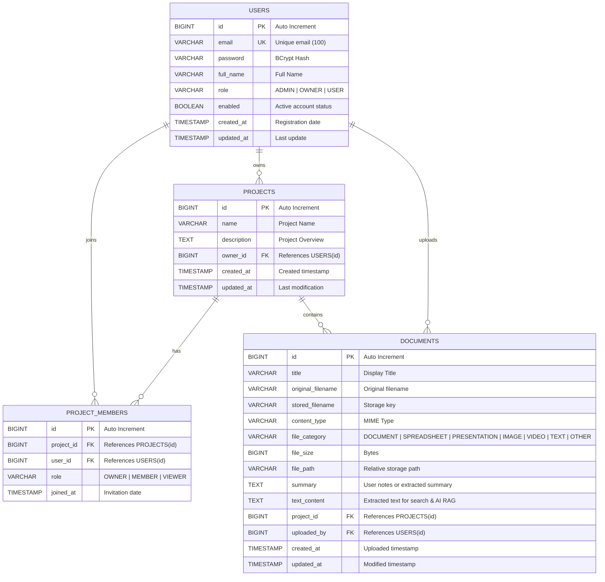

# KBase - Database Architecture & Entity Relationship Diagram (ERD)

## 1. Entity-Relationship Diagram

## 2. Table Specifications & Constraints

### `users`
- Stores user accounts. Passwords hashed using **BCrypt** with salt rounds = 10.
- `role`: Supports 3 user types as defined by requirements:
  - `ROLE_ADMIN`: Global administrator with access to all projects, user accounts, and system stats.
  - `ROLE_OWNER`: Project creator who can create workspaces, invite teammates, and manage project documents.
  - `ROLE_USER`: Standard member who participates in assigned projects, uploads files, and queries the AI chatbot.

### `projects`
- Represents partitioned knowledge base workspaces.
- `owner_id`: Foreign key linked to `users(id)`. Cascades on deletion.

### `project_members`
- Facilitates many-to-many relationships between users and projects.
- Unique constraint on `(project_id, user_id)` ensures a user cannot be added twice to the same project.
- `role`: Project-scoped permission (`OWNER`, `MEMBER`, `VIEWER`).

### `documents`
- Stores document metadata, physical file path, and extracted textual content.
- `file_category`: Classified automatically from file extension upon upload:
  - `DOCUMENT`: `.pdf`, `.doc`, `.docx`, `.odt`
  - `SPREADSHEET`: `.xls`, `.xlsx`, `.csv`
  - `PRESENTATION`: `.ppt`, `.pptx`
  - `IMAGE`: `.jpg`, `.jpeg`, `.png`, `.gif`, `.svg`, `.bmp`
  - `VIDEO`: `.mp4`, `.mov`, `.avi`
  - `TEXT`: `.txt`, `.md`, `.json`, `.yaml`, `.sql`
- `text_content`: Full text extracted via Apache PDFBox and UTF-8 stream readers, enabling instant substring search and AI context retrieval.
